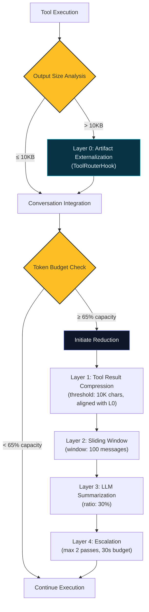
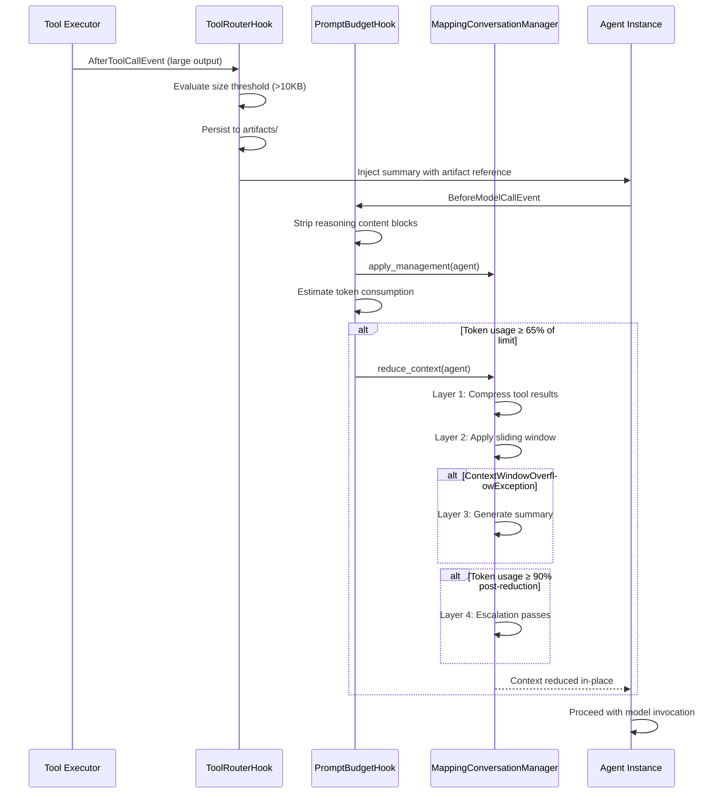

# Context Management

## Abstract

Language models have finite conversation windows. During long security assessments that run for hours with hundreds of tool executions, the conversation can quickly exceed these limits. Cyber-AutoAgent solves this through automated context management that monitors token usage, compresses large outputs, removes old messages, and saves complete evidence to disk.
The system guarantees operational continuity under context pressure while preserving evidence integrity for forensic reporting.

## System Architecture

### Reduction Layer Hierarchy

The context management system employs a five-layer reduction cascade (Layer 0-4), where each layer activates only when preceding layers prove insufficient:



**Layer Summary:**

| Layer | Component                        | Trigger               | Action                                  |
|-------|----------------------------------|-----------------------|-----------------------------------------|
| 0     | ToolRouterHook                   | Output > 10KB         | Externalize to artifact, inject preview |
| 1     | LargeToolResultMapper            | Tool result > 10KB    | Compress with metadata                  |
| 2     | SlidingWindowConversationManager | Messages > window     | Remove oldest (preserve tool pairs)     |
| 3     | SummarizingConversationManager   | Layer 2 overflow      | LLM-based summarization                 |
| 4     | PromptBudgetHook                 | > 90% after reduction | Additional reduction passes             |

### Event-Driven Execution Model

Context management integrates with the Strands SDK event loop through hook callbacks:



## SDK Contract Compliance

The system implements the Strands SDK `ConversationManager` interface with these key requirements:

| Contract                 | Requirement                                                                                  |
|--------------------------|----------------------------------------------------------------------------------------------|
| **Message Modification** | Must use `agent.messages[:] = new` (in-place), not `agent.messages = new`                    |
| **Removal Tracking**     | `removed_message_count` must reflect total messages removed (used as session restore offset) |
| **State Serialization**  | `get_state()` must include `__name__` for class validation                                   |
| **Hook Events**          | `AfterToolCallEvent.result` must be replaced, not mutated                                    |

## Component Specification

### ToolRouterHook

Intercepts tool execution events to manage output sizes before conversation integration.

| Attribute                | Value                                       |
|--------------------------|---------------------------------------------|
| **Location**             | `modules/handlers/tool_router.py`           |
| **SDK Events**           | `BeforeToolCallEvent`, `AfterToolCallEvent` |
| **Truncation Threshold** | 30,000 characters                           |
| **Artifact Threshold**   | 10,000 characters                           |
| **Artifact Retention**   | 100 most recent per session                 |

**Responsibilities**:
- Route unregistered tool invocations to shell executor
- Truncate oversized tool outputs with size metadata
- Externalize large outputs to timestamped artifact files
- Inject inline preview (4KB head) for immediate LLM context

### PromptBudgetHook

Enforces token budget constraints through proactive monitoring and reactive reduction.

| Attribute                | Value                                         |
|--------------------------|-----------------------------------------------|
| **Location**             | `modules/handlers/conversation_budget.py`     |
| **SDK Events**           | `BeforeModelCallEvent`, `AfterModelCallEvent` |
| **Reduction Threshold**  | 65% of context limit                          |
| **Escalation Threshold** | 90% of context limit                          |
| **Warning Threshold**    | 80% (no reductions recorded)                  |

**Execution Sequence**:
1. Strip `reasoningContent` blocks for non-reasoning models
2. Invoke `conversation_manager.apply_management(agent)` proactively
3. Execute `_ensure_prompt_within_budget(agent)` for threshold enforcement
4. Clean up transient attributes post-invocation

### MappingConversationManager

Implements the Strands SDK `ConversationManager` interface with multi-layer reduction strategies.

| Attribute        | Value                                               |
|------------------|-----------------------------------------------------|
| **Location**     | `modules/handlers/conversation_budget.py`           |
| **Base Class**   | `SummarizingConversationManager`                    |
| **Pattern**      | Shared singleton across agent hierarchy             |
| **SDK Contract** | In-place modification via `agent.messages[:] = new` |

**Interface Methods**:

```python
def apply_management(self, agent: Agent, **kwargs) -> None:
    """Proactive context management after each event loop cycle."""

def reduce_context(self, agent: Agent, e: Optional[Exception] = None, **kwargs) -> None:
    """Reactive context reduction on overflow or threshold breach."""

def get_state(self) -> dict[str, Any]:
    """Serialize manager state for session persistence."""

def restore_from_session(self, state: dict[str, Any]) -> Optional[list[Message]]:
    """Restore state and optionally return messages to prepend."""
```

### LargeToolResultMapper

Stateless message mapper implementing the SDK `MessageMapper` protocol for tool result compression.

| Attribute                 | Value                                     |
|---------------------------|-------------------------------------------|
| **Location**              | `modules/handlers/conversation_budget.py` |
| **Compression Threshold** | 10,000 characters                         |
| **Truncation Target**     | 8,000 characters                          |
| **Sample Limit**          | 3 key-value pairs for JSON                |

**Compression Metadata Structure**:
```python
@dataclass
class CompressionMetadata:
    compressed: bool
    original_size: int
    compressed_size: int
    compression_ratio: float
    content_type: str  # "text", "json", "mixed"
    n_original_keys: Optional[int]
    sample_data: Optional[dict]
```

## Token Estimation Model

### Overhead Constants

Token estimation must account for content not present in `agent.messages`:

| Component        | Token Overhead    | Rationale                                     |
|------------------|-------------------|-----------------------------------------------|
| System Prompt    | 8,000 tokens      | Execution prompts, tool guides, phase context |
| Tool Definitions | 3,000 tokens      | JSON schema for registered tools              |
| Message Metadata | 50 tokens/message | Role markers, structural tokens               |

**Estimation Formula**:
```
total_tokens = SYSTEM_OVERHEAD + TOOL_OVERHEAD + (N × MESSAGE_OVERHEAD) + (chars / ratio)
             = 8000 + 3000 + (N × 50) + (total_chars / char_token_ratio)
```

### Model-Specific Character-to-Token Ratios

Different tokenizers exhibit varying compression characteristics:

| Model Family  | Provider           | Ratio  | Tokenizer             |
|---------------|--------------------|--------|-----------------------|
| Claude        | Anthropic, Bedrock | 3.7    | Claude tokenizer      |
| GPT-4/5       | OpenAI, Azure      | 4.0    | tiktoken (cl100k)     |
| Kimi K2       | Moonshot           | 3.8    | Custom BPE            |
| Gemini        | Google, Vertex     | 4.2    | SentencePiece         |
| Default       | Other              | 3.7    | Conservative estimate |

Ratios are resolved dynamically via models.dev integration with result caching.

### Proactive vs Reactive Thresholds

| Threshold               | Percentage         | Trigger                          |
|-------------------------|--------------------|----------------------------------|
| Proactive Compression   | 70% of window size | `apply_management()`             |
| Budget Reduction        | 65% of token limit | `_ensure_prompt_within_budget()` |
| Warning (no reductions) | 80% of token limit | Diagnostic logging               |
| Escalation              | 90% of token limit | Additional reduction passes      |
| Maximum                 | 98% of token limit | Hard ceiling                     |

## Multi-Layer Reduction System

### Layer 0: Artifact Externalization

Intercepts large tool outputs before conversation integration, persisting full output to disk while injecting a preview into the conversation.

**Trigger**: Tool output exceeds 10,000 characters

**Output**: `artifacts/<tool>_<timestamp>_<uuid>.log` with inline preview reference

### Layer 1: Tool Result Compression

Selectively compresses tool results exceeding the compression threshold while preserving semantic content.

**Trigger Conditions**:
- Tool result content exceeds 10,000 characters
- Message resides within the prunable range (excludes preservation zones)

**Compression Operations**:

| Content Type  | Strategy         | Output                                    |
|---------------|------------------|-------------------------------------------|
| Text          | Head truncation  | First 8,000 chars + size indicator        |
| JSON Object   | Key sampling     | First 3 keys (100 char values) + metadata |
| JSON Array    | Element sampling | First 3 elements + length indicator       |

**Preservation Zones**:
- **Initial Zone**: First N messages (`preserve_first`, default: 1)
- **Recent Zone**: Last M messages (`preserve_last`, dynamically scaled)
- **Prunable Range**: Messages between zones eligible for compression

**Dynamic Preservation Scaling**:
```python
preserve_last = max(8, int(window_size * 0.15))  # 15% of window, minimum 8
total_preserved = min(preserve_first + preserve_last, int(window_size * 0.5))  # Cap at 50%
```

### Layer 2: Sliding Window

Maintains bounded conversation length by removing oldest messages while preserving tool execution pairs.

**Configuration**:
- Window size: 100 messages (configurable via `CYBER_CONVERSATION_WINDOW`)
- Prune target: 90% of window (leaves room for new messages)

**Tool Pair Constraint**:
The system ensures `toolUse` blocks are never orphaned from their corresponding `toolResult`:
```
Cannot remove: toolResult without preceding toolUse
Cannot remove: toolUse without following toolResult (unless terminal)
```

### Layer 3: LLM Summarization

Condenses historical conversation segments via model-based summarization when sliding window reduction is insufficient.

**Trigger Conditions**:
- `ContextWindowOverflowException` raised by Layer 2
- Conversation exceeds model limits after window application

**Summarization Parameters**:
- Target ratio: 30% of conversation (oldest messages)
- Preservation: Recent messages retained verbatim
- Output: Single summary message prepended to reduced conversation

### Layer 4: Escalation

Emergency reduction protocol when preceding layers fail to achieve target capacity.

**Escalation Parameters**:
- Maximum passes: 2 additional reduction cycles
- Time budget: 30 seconds total
- Target threshold: Below 90% of token limit

**Termination Conditions**:
1. Token usage falls below 90% threshold
2. Maximum passes exhausted
3. Time budget exceeded

## Artifact Externalization

### Storage Hierarchy

```
outputs/<target>/<operation>/
├── artifacts/
│   ├── <tool>_<timestamp>_<uuid>.log
│   ├── <tool>_<timestamp>_<uuid>.log
│   └── ...
├── logs/
│   └── cyber_operations.log
└── report.md
```

### Artifact Lifecycle

| Phase     | Action                                            |
|-----------|---------------------------------------------------|
| Creation  | Atomic write with UUID collision retry            |
| Naming    | `{tool_name}_{YYYYMMDD_HHMMSS}_{uuid6}.log`       |
| Cleanup   | Retain 100 most recent, remove on threshold (150) |
| Reference | Relative path injected into conversation          |

### Inline Preview

Artifact references include immediate context for LLM comprehension:
```
[Tool output: 125,432 chars total | Preview: 25,000 chars below | Full: artifacts/nmap_20241124_143022_a1b2c3.log]

<first 25,000 characters>

[Artifact head - 4000 chars:]
<artifact preview>

[Complete output saved to: artifacts/nmap_20241124_143022_a1b2c3.log]
```

## Configuration Reference

### Environment Variables

#### Token Budget Controls

| Variable                            | Default | Description                                                                                |
|-------------------------------------|---------|--------------------------------------------------------------------------------------------|
| `CYBER_CONTEXT_LIMIT`               | 200,000 | Maximum context window size in tokens. Used when provider-specific limits are unavailable. |
| `CYBER_PROMPT_TELEMETRY_THRESHOLD`  | 0.65    | Reduction trigger threshold (65%)                                                          |
| `CYBER_PROMPT_CACHE_RELAX`          | 0.1     | Threshold relaxation when prompt caching active                                            |

#### Tool Result Handling

| Variable                               | Default | Description                           |
|----------------------------------------|---------|---------------------------------------|
| `CYBER_TOOL_COMPRESS_TRUNCATE`         | 8,000   | Compression target size (characters)  |
| `CYBER_TOOL_MAX_RESULT_CHARS`          | 30,000  | Conversation truncation limit         |
| `CYBER_TOOL_RESULT_ARTIFACT_THRESHOLD` | 10,000  | Artifact externalization trigger      |

#### Conversation Preservation

| Variable                             | Default | Description                                                               |
|--------------------------------------|---------|---------------------------------------------------------------------------|
| `CYBER_CONVERSATION_WINDOW`          | 100     | Sliding window size (messages)                                            |
| `CYBER_CONVERSATION_PRESERVE_FIRST`  | 1       | Initial messages to preserve                                              |
| `CYBER_CONVERSATION_PRESERVE_LAST`   | 5       | Recent messages to preserve (reduced from 12 to prevent pruning deadlock) |

### Code-Level Constants

```python
# Token estimation overhead
SYSTEM_PROMPT_OVERHEAD_TOKENS = 8000
TOOL_DEFINITIONS_OVERHEAD_TOKENS = 3000
MESSAGE_METADATA_OVERHEAD_TOKENS = 50

# Reduction thresholds
PROACTIVE_COMPRESSION_THRESHOLD = 0.7   # 70% of window triggers proactive compression
ESCALATION_THRESHOLD_RATIO = 0.9        # 90% triggers escalation
MAX_THRESHOLD_RATIO = 0.98              # Hard ceiling

# Escalation parameters
ESCALATION_MAX_PASSES = 2
ESCALATION_MAX_TIME_SECONDS = 30.0

# Conversation analysis
SMALL_CONVERSATION_THRESHOLD = 3        # Skip pruning below this count
DEFAULT_CHAR_TO_TOKEN_RATIO = 3.7       # Conservative default
```

## Prompt Caching Integration

### Mechanism

The system constructs prompts as `SystemContentBlock[]` with cache point hints for providers supporting prompt caching (Anthropic via LiteLLM, Bedrock):

```json
[
  {"text": "<composed system prompt>"},
  {"cachePoint": {"type": "default"}}
]
```

### Provider Behavior

| Provider            | Caching Support | Fallback            |
|---------------------|-----------------|---------------------|
| Bedrock             | Supported       | N/A                 |
| LiteLLM (Anthropic) | Supported       | N/A                 |
| Other               | Ignored         | Plain string prompt |

### Threshold Relaxation

When prompt caching is active (`_prompt_cache_hit` or `CYBER_PROMPT_CACHE_HINT=true`), the reduction threshold is relaxed by `PROMPT_CACHE_RELAX` (default: 10%) to avoid premature reductions that would invalidate cache entries.

## Session Persistence

The conversation manager state is serialized via `get_state()` and restored via `restore_from_session()`. The `removed_message_count` field is critical—it serves as an offset when the SDK restores messages from session storage, ensuring removed messages are properly skipped.

## Diagnostic Framework

### Log Messages

| Pattern                                                 | Level   | Indicates                                |
|---------------------------------------------------------|---------|------------------------------------------|
| `TOKEN ESTIMATION FAILED: agent.messages is None`       | WARNING | Messages not initialized                 |
| `TOKEN ESTIMATION FAILED: agent.messages is not a list` | WARNING | Invalid message type                     |
| `TOKEN ESTIMATION: agent.messages is empty`             | INFO    | Valid empty state                        |
| `TOKEN ESTIMATION ERROR: Exception during estimation`   | ERROR   | Estimation failure with traceback        |
| `BUDGET CHECK FALLBACK: Using telemetry tokens`         | INFO    | Estimation failed, using telemetry proxy |
| `BUDGET CHECK ABORT: No estimation and no telemetry`    | ERROR   | Complete budget enforcement failure      |
| `THRESHOLD EXCEEDED: context=X, threshold=Y`            | WARNING | Reduction triggered                      |
| `LAYER 2 COMPRESSION: Compressing N tool result(s)`     | INFO    | Compression applied                      |
| `Context reduced via X manager: messages A->B`          | INFO    | Reduction complete                       |

### Fallback Behavior

When token estimation fails, the system degrades gracefully:

1. **Primary**: Character-based estimation with model-specific ratios
2. **Secondary**: SDK telemetry (`event_loop_metrics.accumulated_usage.inputTokens`)
3. **Tertiary**: Operation continues without budget enforcement (logged as ERROR)

## Operational Characteristics

### Performance Bounds

| Operation              | Complexity          | Typical Latency  |
|------------------------|---------------------|------------------|
| Token estimation       | O(n) messages       | < 10ms           |
| Layer 1 compression    | O(n) content blocks | < 50ms           |
| Layer 2 sliding window | O(1) slice          | < 1ms            |
| Layer 3 summarization  | O(tokens) LLM call  | 2-10s            |
| Layer 4 escalation     | O(passes × layers)  | ≤ 30s            |

### Memory Considerations

- Message modification occurs in-place (`agent.messages[:] = new`)
- Deep copy used only for compression to prevent aliasing
- Artifact cleanup prevents unbounded disk growth
- Reduction history capped at 5 events per agent

## Troubleshooting

### Symptoms and Resolutions

| Symptom                  | Likely Cause               | Resolution                                                                                    |
|--------------------------|----------------------------|-----------------------------------------------------------------------------------------------|
| Tokens grow unbounded    | Estimation failure         | Check for `TOKEN ESTIMATION FAILED` logs; verify `CYBER_CONTEXT_LIMIT`                        |
| Reductions ineffective   | Preservation overlap       | Reduce `CYBER_CONVERSATION_PRESERVE_LAST`; verify prunable range exists                       |
| Budget checks not firing | Hook registration failure  | Verify `HOOK REGISTRATION: PromptBudgetHook` in logs                                          |
| Layer 2 never triggers   | Artifact threshold too low | Verify `CYBER_TOOL_RESULT_ARTIFACT_THRESHOLD` (default: 10,000); compression is 4x this value |
| Excessive log volume     | LiteLLM DEBUG logging      | Verify `logger.py` silences LiteLLM at WARNING level                                          |

### Validation Commands

```bash
# Verify token estimation
grep "TOKEN ESTIMATION" logs/cyber_operations.log | tail -20

# Check reduction activity
grep "Context reduced" logs/cyber_operations.log | wc -l

# Monitor compression triggers
grep "LAYER 2 COMPRESSION" logs/cyber_operations.log

# Verify hook registration
grep "HOOK REGISTRATION" logs/cyber_operations.log
```

## References

- Strands SDK: `ConversationManager` interface, `MessageMapper` protocol, Hook events
- models.dev: Provider-specific token limits and ratios
